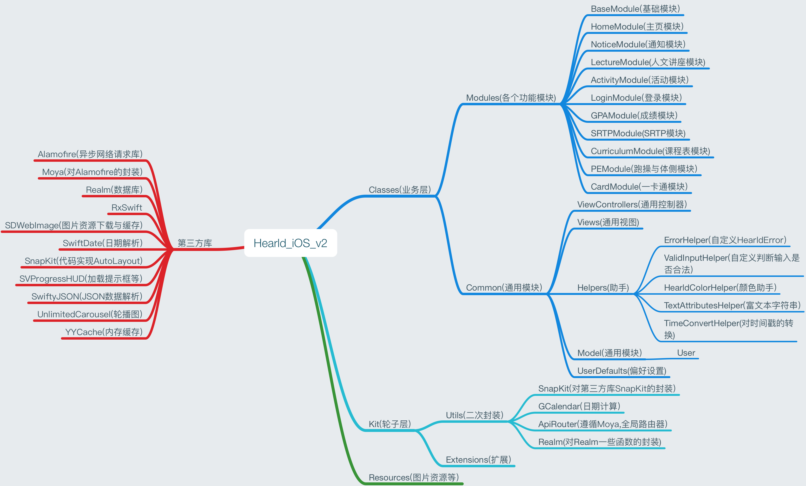

# Herald_iOS_v2
小猴偷米 iOS客户端v2 试验品

## What's new

* 使用MVVM的设计模式，使用RxSwift的编程接口，遵循FRP的编程思想。
* 使用SnapKit完成代码布局，弃用StoryBoard。
* 使用Moya作为网络请求的Router。
* 不再使用UserDefault作为缓存容器，暂定使用YYCache和Realm，协同内存缓存与磁盘缓存。

## 目前进度

##### 1.业务逻辑层

- [ ] 首页网络请求逻辑(ing)
- [ ] 信息板(ing)
- [x] 登录模块
- [x] 活动模块
- [ ] 我的模块(待讨论)
- [ ] 课表模块
- [x] 通知模块
- [ ] jwc模块
- [ ] 跑操模块
- [x] 成绩GPA模块
- [x] SRTP
- [x] 人文讲座模块
- [ ] ….

##### 2.轮子层

- [x] ApiRouter(网络请求路由器)
- [x] SnapKit(代码布局,通神的轮子,照样子扩展即可)

##### 3.手机功能与UI花样

- [ ] Notification
- [ ] 转场动画，可使用Hero
- [ ] Alert美化

## 目前架构示意图

## 开发须知

### 关于MVVM/RxSwift/FRP的学习资料

- http://reactivex.io (ReactiveX组织的官网)
- https://www.gitbook.com/book/mcxiaoke/rxdocs/details (上面的文档中文翻译)
- https://academy.realm.io/posts/slug-max-alexander-mvvm-rxswift/ (某不认识的大牛(maybe)关于MVVM与RxSwift的讲座)
- https://www.boxueio.com/series/rxswift-101 (泊学关于RxSwift的教程,付费)

### Moya Router

所有API的抽象层次的封装，参照Moya官方文档即可。

### 关于数据存储与缓存

其实这一问题我当时想了很久，目前可以说还在探索阶段吧。version1使用UserDefault存放API所返回的JSON数据作为缓存，这是一个很trick的做法，但并不是应推崇的做法，UserDefault应该存放一些用户配置项，服务端配置项等等。

最初打算使用Realm序列化通用Model作为数据库存储，Realm拥有查询速度快，文档详细，跨平台等优点。辅以Cache作为缓存。但是使用原生Cache还是第三方库的Cache没有决定好，原本是想着先用原生的。

**2018.4.25**

但Realm使用下来其实体验并不是那么好，包括各种realm对象满天飞来保证线程安全，功能虽多，但真用不到，且并不提供内存缓存。而YYCache作为一整套框架，提供对NSCache以及sqlite的封装，至于框架内部的协同暂时还没看，总之既然要使用内存缓存，不如直接换用一整套支持内存缓存和磁盘缓存的框架。

**2018.4.26**

我原本想着YYCache虽然是OC框架，但应该还能用吧…经过各种测试，YYDiskCache真的用不了，但YYMemoryCache还行。之后我也看了包括AwesomeCache、Track等Swift写的缓存框架，都有各自的问题，而且全部都..不再维护了…简直是逼我直接用NSCache算了。

捣鼓那么久，最后决定使用YYCache+Realm吧。

## 开发文档

暂无详细

目前可以参照LoginModule、ActivityModule为例子阅读以了解一个模块的MVVM架构，以及RxSwift的基本编程模式。
